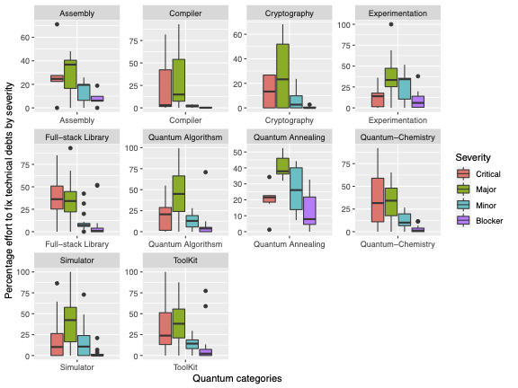

## Technical Debts and Faults in Open-source Quantum Software Systems: An Empirical Study

### Abstract
Quantum computing is a rapidly growing field attracting the interest of both researchers and software developers. Supported by its numerous open-source tools, developers can now build, test, or run their quantum algorithms.  Although the maintenance practices for traditional software systems have been extensively studied, the maintenance of quantum software is still a new field of study but a critical part to ensure the quality of a whole quantum computing system. In this work, we set out to investigate the distribution and evolution of technical debts in quantum software and their relationship with fault occurrences. Understanding these problems could guide future quantum development and provide maintenance recommendations for the key areas where quantum software developers and researchers should pay more attention. In this paper, we empirically studied 118 open-source quantum projects, which were selected from GitHub. The projects are categorized into 10 categories. We found that the studied quantum software suffers from the issues of code convention violation, error-handling, and code design. We also observed a statistically significant correlation between code design, redundant code or code convention, and the occurrences of faults in quantum software.

#### Highlights
- The quantum software systems suffer from code convention violation, error-handling, and code redundancy, mostly in the initial versions.

- There is a statistically significant correlation between technical debts (such as code convention, error-handling, redundant code, cognitive complexity of code) and fault occurrences in quantum software systems.

- The quantum software developers should use the existing static analysis tools to examine their code. Code reviewers and quantum quality assurance team should pay attention to the code quality and code size, especially when new files are added. %Code reviewers and quantum quality assurance team should use metrics like code convention, code redundancy, error-handling, and the cognitive complexity of the code to predict faulty commits.

- New tools should be introduced to support identifying quantum-specific problems, such as the technical debts and faults that only occur in a quantum software system. %Future works are appealed to study other aspects of quantum software in terms of maintenance and reliability.

- Future works are appealed to study other aspects of quantum software in terms of maintenance and reliability, such as code review, verification methods to ensure the correctness of a quantum program, and practical fault detection techniques for supporting quantum systematic testing and debugging.

##### Table of Contents  

 [Reseach-Questions](#Reseach-Questions)  
> Here we described the three main research questions that was answered in this study

 [Source](#Source)  
> Descriptions of the most important source codes contains in this repository

 [Datasets](#Datasets)  
> This provides the descriptions of the datasets contains in this repository

[Results](#Results)  
> Details the main results with plots and figures embedded in this repository is described here

 [Studied-Quantum-projects](#Studied-Quantum-projects) > List of the studied quantum projects, the respective categories, the number of Snapshots and their meta-data

## Reseach-Questions

#### RQ1: What Are the Characteristics of Technical Debts in Quantum Software?

 ⋅⋅⋅ We examined the distribution of technical debts in quantum software systems represented as code smells and coding errors and their severity (categorise as critical, major, minor, and blocker). We summarized the technical debts based on the types of technical debts and highlighted the critical debts. Results show that about 80% of the technical debts are related to the code smells and more than half of technical debts in all software types belong to the major severity. The major severity are quality issues or flaw that can highly impact the productivity of developer, for example, an uncovered piece of code, unused parameters, or duplicated blocks.}

 ⋅⋅⋅ In addition, we found that a few types of technical debts (such as `code convention` (problem with coding convention such as formatting, naming, white-space), `design issues` (e.g., duplicate string literals), `brain-overload` (related to cognitive complexity), and `error-handling') dominate the total number of technical debts.

#### RQ2: How Do Technical Debts Evolve Over Time?

 ⋅⋅⋅ We investigated how new technical debts are added into the code-base with respect to the total file size over time. We observe that technical debts tend to be added in the initial versions of a project (when most new codes and files are added). Besides, we found that LOC can be considered as key indicators of the existence of technical debts in quantum computing software systems.

 ⋅⋅⋅ This result is in line with the studies on traditional software. We recommend quantum software developers pay more attention to the code quality and code size, especially when new files are added to the code base.

 #### RQ3: What Is the Relationship Between Technical Debts and Faults?

  ⋅⋅⋅ In this research question, we used regression models to examine the correlation between technical debts (and their types) and fault-inducing commits in quantum software at the file level. Our results indicate a statistically significant correlation. Particularly, we found that the highest significance in all studied quantum software systems is related to `convention` and `unused` technical debts.

## Source

- The folder source contains all the source codes which was used during our data collection and analysis steps. It consist of three subfolders `R` (source codes for r), `Python` (Python code) and `Jupyter` (Jupyter code)

- All the data collection and analysis was done in plain Python project and respectively the codes are within the folder `Python`.

- Specifically Jupyter folder contain the  investigating the correlation of technical debts and fault-inducing commits for answering research question three (RQ3).

- All subfolders are self-explanatory, i.e., with descriptive folder names. Also, for easy browsing through the source codes, each folders are named with the target research question its written for.

## Datasets

The datasets used for this study are stored in the folders `RQs`, `faults`, and `general`. In the following we briefly explain the contents in each folder

1. The folder `RQs` contains the datasets for the three proposed research questions

2. The folder `faults` contains the fault-inducing and fault-fixing commits and their meta data.  

3. The folder `general` contains mainly the meta-data of the studied quantum projects, their snapshots and other the initial dataset that do not directly answers the research questions but were used to primary for the preparation.

## Results
Here we Highlights some of the interesting results of our analysis for the proposed three research questions.

#### RQ1: The Characteristics of Technical Debts in Quantum Software.

The Figures 1a and 1b present the composition of technical debts by quantum software category. We show the percentage of the estimated time required to fix the technical debts (errors and code smells) and the severity assessed based on the total fixing effort in each of the project's snapshots in a quantum category.

")
> Figure 1a: Effort required to fix technical debts in terms of the debt types (coding errors and code smells)

> Figure 1b: Effort required to fix the technical debts in terms of types

#### RQ2: How Technical Debts Evolve Over Time

In two Figures bellow illustrates examples of how new technical debts were added to the projects over time across the studied snapshots. The presented figures are extracted from the QCFractal of category Quantum Chemistry and quantum Fullstack library (i.e., strawberryfields). The technical debt in the first snapshot of each application is new; the divergence from the horizontal line indicates the supplementary debt that has been introduced or removed or both.

")
> Figure 2a: The evolution of TDR with development time in QCFractal (i.e., of category Quantum Chemistry)

")
> Figure 2b: The evolution of TDR with development time in strawberryfields (i.e., of category Fullstack library)

## Studied-Quantum-projects

- The table bellow contains the list of open-source quantum projects hosted on GitHub that we studied. To obtained the selected projects, we searched for the term `quantum` using the Rest API provided by GitHub. The approach returned all repositories that contains the term `quantum’ either in ​​repository name, descriptions, or project ReadME file, case insensitive. All the listed projects are mainline, not younger than 10 months from the time of starting this study. In addition we only selected projects that contain at least 100 commits, 10 issues in the past 10 months, and have been released at least once. These metrics were used as the proxy to determine whether the selected projects are developed, enhanced, and have been improved over time hence measuring the maturity and the activity on the selected quantum projects.

- The column **Category** indicate the category of each of the projects. We used the list of categories provided by the [Quantum foundation for software engineering (QoSE)](https://qosf.org/) to decide which category a project belongs to, we first checked whether a target project is listed by QoSF. If it is listed, we will directly use the QoSF provided category for this project. Otherwise, we manually categorize them following the discussions and reaching an agreement.

- The column Snapshots indicate the number of snapshots extracted basing on 90 days interval from the creation date of the projects.

> List of 118 open-source quantum projects hosted on GitHub.

|#|Repository|Category|commits|Size|Releases|Stars|Snapshots|CreatedAt|Age|Language|Homepage|Descriptions|
|---:|:------|:-------|------:|---:|-------:|----:|--------:|:---------|---:|:------|:-------|:-----------|
|1|[lanl/qmasm](https://github.com/lanl/qmasm)|Assembly|306|486|6|303|14|2016-07-08T20:10:22Z|1525|Python||Quantum macro assembler for D-Wave systems|
|2|[XanaduAI/blackbird](https://github.com/XanaduAI/blackbird)|Assembly|151|2959|3|28|6|2018-10-25T21:24:07Z|684|C++|[blackbird](https://quantum-blackbird.readthedocs.io)|Blackbird is a quantum assembly language for continuous-variable quantum computation, that can be used to program Xanadu's quantum photonics hardware and Strawberry Fields simulator.|
|3|[BBN-Q/pyqgl2](https://github.com/BBN-Q/pyqgl2)|Assembly|130|1977|0|5|11|2017-04-10T18:44:19Z|1165|Python||An imperative Quantum Gate Language (QGL) embedded in python.|
|4|[artiste-qb-net/qubiter](https://github.com/artiste-qb-net/qubiter)|Assembly|366|13129|0|95|11|2016-03-21T05:34:07Z|1655|HTML||Python tools for reading, writing, compiling, simulating quantum computer circuits. Includes numpy and tensorflow backends. “Quantum Space, the final frontier. These are the voyages of the starship Qubiter. Its five-year mission: to explore strange new worlds, to seek out new life and new civilizations, to boldly go where no man has gone before.”|
|5|[BBN-Q/QGL.jl](https://github.com/BBN-Q/QGL.jl)|Assembly|109|118|0|8|4|2016-12-20T14:47:00Z|1276|Julia||A performance orientated QGL compiler.|
|6|[Qiskit/qiskit-terra](https://github.com/Qiskit/qiskit-terra)|Full-stack Library|3452|51762|56|2782|15|2017-03-03T17:02:42Z|1302|Python|[qiskit-terra](https://qiskit.org/terra)|Terra provides the foundations for Qiskit. It allows the user to write quantum circuits easily, and takes care of the constraints of real hardware.|
|7|[microsoft/Quantum](https://github.com/microsoft/Quantum)|Full-stack Library|228|37677|1963|2878|11|2017-11-08T23:24:33Z|1051|PowerShell|[Quantum](https://docs.microsoft.com/quantum)|Microsoft Quantum Development Kit Samples|
|8|[microsoft/QuantumLibraries](https://github.com/microsoft/QuantumLibraries)|Full-stack Library|268|12831|1896|188|11|2018-10-23T18:26:23Z|701|C#|[QuantumLibraries](https://docs.microsoft.com/quantum)|Q# libraries for the Quantum Development Kit|
|9|[microsoft/Quantum-NC](https://github.com/microsoft/Quantum-NC)|Full-stack Library|101|1502|1882|79|8|2018-01-23T19:10:35Z|965|F#||Microsoft Quantum Computing Libraries for noncommercial use|
|10|[rigetti/pyquil](https://github.com/rigetti/pyquil)|Full-stack Library|957|69128|64|1033|15|2017-01-09T21:30:22Z|1354|Python|[pyquil](http://docs.rigetti.com)|A Python library for quantum programming using Quil.|
|11|[Qiskit/qiskit](https://github.com/Qiskit/qiskit)|Full-stack Library|612|96678|34|978|8|2018-12-12T22:04:07Z|652|Python|[qiskit](https://qiskit.org)|Qiskit is an open-source framework for working with noisy quantum computers at the level of pulses, circuits, and algorithms.|
|12|[Qiskit/qiskit-ibmq-provider](https://github.com/Qiskit/qiskit-ibmq-provider)|Full-stack Library|365|1608|24|76|8|2018-12-26T15:22:11Z|637|Python||Qiskit Provider for accessing the quantum devices and simulators at IBMQ|
|13|[qiskit-community/qiskit-js](https://github.com/qiskit-community/qiskit-js)|Full-stack Library|367|4211|23|86|8|2017-11-21T09:34:29Z|1032|JavaScript||:atom_symbol: Qiskit (Quantum Information Science Kit) for JavaScript|
|14|[qiskit-community/qiskit-vscode](https://github.com/qiskit-community/qiskit-vscode)|Full-stack Library|321|7218|23|51|5|2018-07-19T15:59:16Z|704|HTML|[qiskit-vscode](https://qiskit.org/vscode)|Simplifying Qiskit to make developing quantum circuits and applications faster|
|15|[rigetti/rpcq](https://github.com/rigetti/rpcq)|Full-stack Library|114|342|23|53|7|2018-10-11T19:38:34Z|714|Common Lisp||The RPC framework and message specification for @rigetti Quantum Cloud Services.|
|16|[ProjectQ-Framework/ProjectQ](https://github.com/ProjectQ-Framework/ProjectQ)|Full-stack Library|193|1005|16|625|11|2016-12-28T09:31:53Z|1367|Python|[ProjectQ](https://projectq.ch)|ProjectQ: An open source software framework for quantum computing|
|17|[QuantumPackage/qp2](https://github.com/QuantumPackage/qp2)|Full-stack Library|550|20402|16|22|6|2019-01-25T08:32:32Z|586|Fortran|[qp2](https://quantumpackage.github.io/qp2/)|Quantum Package : a programming environment for wave function methods|
|18|[XanaduAI/strawberryfields](https://github.com/XanaduAI/strawberryfields)|Full-stack Library|792|15802|15|377|10|2018-03-26T14:38:39Z|914|Python|[strawberryfields](https://strawberryfields.readthedocs.io)|Strawberry Fields is a full-stack Python library for designing, simulating, and optimizing continuous variable (CV) quantum optical circuits.|
|19|[Blueqat/Blueqat](https://github.com/Blueqat/Blueqat)|Full-stack Library|528|1043|10|245|8|2018-08-02T00:18:23Z|782|Python||Quantum Computer Library for Everyone|
|20|[quantumlib/Cirq](https://github.com/quantumlib/Cirq)|Full-stack Library|1503|8593|9|2345|12|2017-12-14T23:41:49Z|1015|Python||A python framework for creating, editing, and invoking Noisy Intermediate Scale Quantum (NISQ) circuits.|
|21|[softwareQinc/staq](https://github.com/softwareQinc/staq)|Full-stack Library|178|9634|3|44|5|2019-05-14T17:02:22Z|490|C++|[staq](https://arxiv.org/abs/1912.06070)|A full-stack quantum processing toolkit|
|22|[theQRL/QRL](https://github.com/theQRL/QRL)|Cryptography|3556|14118|84|328|14|2016-10-16T14:32:40Z|1437|Python|[QRL](https://theqrl.org/)|Quantum Resistant Ledger |
|23|[exaexa/codecrypt](https://github.com/exaexa/codecrypt)|Cryptography|374|20181|19|244|19|2012-11-05T22:09:23Z|2851|C++|[codecrypt](https://gitea.blesmrt.net/exa/codecrypt)|Post-quantum cryptography tool (THIS REPOSITORY IS ONLY A MIRROR OF THE MAIN ONE, PLEASE DO NOT FILE BUGS HERE)|
|24|[mupq/pqm4](https://github.com/mupq/pqm4)|Cryptography|171|1677|1|77|9|2018-03-16T09:58:41Z|922|Assembly||Post-quantum crypto library for the ARM Cortex-M4|
|25|[supernomad/quantum](https://github.com/supernomad/quantum)|Cryptography|416|752|28|44|6|2016-05-31T06:23:57Z|1504|Go||A lightweight, encrypted, WAN oriented, software defined network device.|
|26|[arguelles/nuSQuIDS](https://github.com/arguelles/nuSQuIDS)|Simulator|726|48312|1|10|21|2014-09-17T13:25:12Z|2196|C++||Neutrino oscillation software using SQuIDS.|
|27|[softwareQinc/qpp](https://github.com/softwareQinc/qpp)|Simulator|2619|284707|30|208|21|2014-03-21T20:00:40Z|2379|C++|[qpp](https://journals.plos.org/plosone/article?id=10.1371/journal.pone.0208073)|A modern C++11 quantum computing library|
|28|[QuantumBFS/YaoBlocks.jl](https://github.com/QuantumBFS/YaoBlocks.jl)|Simulator|307|516|27|14|6|2018-11-22T17:10:59Z|662|Julia||Standard basic quantum circuit simulator building blocks.|
|29|[issp-center-dev/HPhi](https://github.com/issp-center-dev/HPhi)|Simulator|1752|384920|22|42|19|2015-09-11T02:40:51Z|1839|Shell|[HPhi](https://www.pasums.issp.u-tokyo.ac.jp/hphi/en/)|Quantum Lattice Model Simulator Package|
|30|[SoftwareQuTech/SimulaQron](https://github.com/SoftwareQuTech/SimulaQron)|Simulator|788|6661|21|68|11|2017-06-25T10:14:59Z|1175|Python||Quantum Network Simulator for Application Programming|
|31|[QuantumBFS/Yao.jl](https://github.com/QuantumBFS/Yao.jl)|Simulator|477|14433|18|335|9|2018-04-13T13:47:02Z|895|Julia|[Yao.jl](http://yaoquantum.org)|Extensible, Efficient Quantum Algorithm Design for Humans.|
|32|[Strilanc/Quirk](https://github.com/Strilanc/Quirk)|Simulator|1297|21709|16|497|16|2014-03-05T23:31:28Z|2395|JavaScript|[Quirk](http://algassert.com/quirk)|A drag-and-drop quantum circuit simulator that runs in your browser. A toy for exploring and understanding small quantum circuits.|
|33|[Qiskit/qiskit-aer](https://github.com/Qiskit/qiskit-aer)|Simulator|495|13922|16|140|9|2018-12-17T19:58:16Z|647|Python|[qiskit-aer](https://qiskit.org/aer)|Aer is a high performance simulator for quantum circuits that includes noise models|
|34|[qutip/qutip](https://github.com/qutip/qutip)|Simulator|4105|20039|14|841|37|2012-10-09T06:20:46Z|2908|Python|[qutip](http://qutip.org)|QuTiP: Quantum Toolbox in Python|
|35|[QuEST-Kit/QuEST](https://github.com/QuEST-Kit/QuEST)|Simulator|1084|10500|14|150|13|2017-03-28T12:00:18Z|1273|C++|[QuEST](https://quest.qtechtheory.org/)|A multithreaded, distributed, GPU-accelerated simulator of quantum computers|
|36|[vm6502q/qrack](https://github.com/vm6502q/qrack)|Simulator|684|13360|12|54|11|2017-12-21T01:15:29Z|1008|C++||Comprehensive, GPU accelerated framework for developing universal virtual quantum processors|
|37|[qulacs/qulacs](https://github.com/qulacs/qulacs)|Simulator|503|1162|12|138|7|2018-10-05T05:39:51Z|704|C++||Variational Quantum Circuit Simulator for Quantum Computation Research|
|38|[quantumlib/OpenFermion-Cirq](https://github.com/quantumlib/OpenFermion-Cirq)|Simulator|230|1757|5|229|9|2018-03-20T00:58:53Z|920|Python||Quantum circuits for simulations of quantum chemistry and materials.|
|39|[microsoft/qmt](https://github.com/microsoft/qmt)|Simulator|841|67172|4|40|6|2018-02-23T21:14:58Z|845|Python||Qubit Modeling Tools (QMT) for computational modeling of quantum devices|
|40|[Approximates/dotBloch](https://github.com/Approximates/dotBloch)|Simulator|202|47053|4|0|6|2018-06-02T21:00:14Z|811|C#||quantum bit simulator build in Unity 3D engine.|
|41|[Qiskit/qiskit-jku-provider](https://github.com/Qiskit/qiskit-jku-provider)|Simulator|215|283|2|12|4|2018-06-27T19:36:57Z|803|C++|[qiskit-jku-provider](http://iic.jku.at/eda/research/quantum_simulation/)|A local provider which allows Qiskit to use a decision-diagrams quantum simulator from JKU|
|42|[ngnrsaa/qflex](https://github.com/ngnrsaa/qflex)|Simulator|1282|3509|1|54|6|2019-02-07T21:08:10Z|595|C++||Flexible Quantum Circuit Simulator (qFlex) implements an efficient tensor network, CPU-based simulator of large quantum circuits.|
|43|[aparent/QCViewer](https://github.com/aparent/QCViewer)|Simulator|280|5013|6|17|9|2012-01-11T17:49:28Z|3141|C++|[QCViewer](http://qcirc.iqc.uwaterloo.ca/)|A visual quantum circuit design and simulation tool.|
|44|[rigetti/qvm](https://github.com/rigetti/qvm)|Simulator|414|1047|31|260|5|2018-11-20T22:14:22Z|674|Common Lisp||The @rigetti high-performance quantum virtual machine.|
|45|[marvel-nccr/quantum-mobile](https://github.com/marvel-nccr/quantum-mobile)|Simulator|282|3286|27|44|10|2017-10-09T22:10:36Z|1076|Shell|[quantum-mobile](https://materialscloud.org/quantum-mobile)|A Virtual Machine for computational materials science|
|46|[evaleev/libint](https://github.com/evaleev/libint)|ToolKit|1107|34752|44|104|54|2013-08-13T21:17:06Z|2597|C++||Libint: high-performance library for computing Gaussian integrals in quantum mechanics|
|47|[qojulia/QuantumOptics.jl](https://github.com/qojulia/QuantumOptics.jl)|ToolKit|434|5089|26|265|21|2016-03-16T22:05:35Z|1646|Julia|[QuantumOptics.jl](http://qojulia.org)|Library for the numerical simulation of closed as well as open quantum systems.|
|48|[jcmgray/quimb](https://github.com/jcmgray/quimb)|ToolKit|1171|12146|14|121|19|2015-12-09T14:02:41Z|1749|Python|[quimb](http://quimb.readthedocs.io)|A python library for quantum information and many-body calculations including tensor networks.|
|49|[XanaduAI/pennylane](https://github.com/XanaduAI/pennylane)|ToolKit|1398|27738|12|487|10|2018-04-17T16:45:42Z|892|Python|[pennylane](https://pennylane.ai)|PennyLane is a cross-platform Python library for quantum machine learning, automatic differentiation, and optimization of hybrid quantum-classical computations|
|50|[OriginQ/QPanda-2](https://github.com/OriginQ/QPanda-2)|ToolKit|450|15205|11|83|9|2018-06-05T08:23:20Z|840|C++|[QPanda-2](http://originqc.com.cn/QPanda/download.html)|QPanda 2 is an open source quantum computing framework developed by  OriginQC that can be used to build, run, and optimize quantum algorithms. |
|51|[CQCL/pytket](https://github.com/CQCL/pytket)|ToolKit|192|15122|11|76|7|2018-07-11T09:39:17Z|805|nan||Python module for interfacing with the CQC t|ket> library of quantum software|
|52|[bloomberg/quantum](https://github.com/bloomberg/quantum)|ToolKit|237|2515|6|169|9|2018-07-11T20:40:04Z|806|C++||Powerful multi-threaded coroutine dispatcher and parallel execution engine|
|53|[rigetti/forest-benchmarking](https://github.com/rigetti/forest-benchmarking)|ToolKit|192|9883|6|29|5|2018-12-17T19:53:19Z|552|Python||A library for quantum characterization, verification, validation (QCVV), and benchmarking using pyQuil.|
|54|[QInfer/python-qinfer](https://github.com/QInfer/python-qinfer)|ToolKit|1107|4249|4|69|20|2012-08-15T01:02:45Z|2909|Python||Library for Bayesian inference via sequential Monte Carlo for quantum parameter estimation.|
|55|[zoran-cuckovic/QGIS-visibility-analysis](https://github.com/zoran-cuckovic/QGIS-visibility-analysis)|ToolKit|128|4763|4|34|7|2014-02-08T08:00:12Z|2388|Python||Quantum GIS plugin for visibility analysis|
|56|[qubekit/QUBEKit](https://github.com/qubekit/QUBEKit)|ToolKit|361|2810|2|4|8|2019-04-10T09:17:09Z|534|Python|[QUBEKit](https://blogs.ncl.ac.uk/danielcole/qube-force-field/)|  Quantum Mechanical Bespoke Force Field Derivation Toolkit|
|57|[tensorflow/quantum](https://github.com/tensorflow/quantum)|ToolKit|198|15395|2|877|3|2020-02-06T19:58:35Z|231|Python|[quantum](https://www.tensorflow.org/quantum)|Hybrid Quantum-Classical Machine Learning in TensorFlow|
|58|[redhat-cip/openstack-quantum-puppet](https://github.com/redhat-cip/openstack-quantum-puppet)|ToolKit|175|408|1|1|3|2012-09-29T22:01:47Z|585|Puppet||Deploy Quantum with Puppet|
|59|[boschmitt/tweedledum](https://github.com/boschmitt/tweedledum)|ToolKit|266|9261|1|41|1|2018-07-13T20:03:36Z|803|C++||C++17 Library for writing, manipulating, and optimizing quantum circuits|
|60|[TRIQS/triqs](https://github.com/TRIQS/triqs)|ToolKit|2259|14086|17|89|28|2013-07-17T16:06:50Z|2607|C++|[triqs](https://triqs.github.io)|a Toolbox for Research on Interacting Quantum Systems|
|61|[QuTech-Delft/qtt](https://github.com/QuTech-Delft/qtt)|ToolKit|1342|60850|5|21|16|2016-04-19T16:06:57Z|1619|Python||Quantum Technology Toolbox https://qtt.readthedocs.io/|
|62|[lmacken/quantumrandom](https://github.com/lmacken/quantumrandom)|ToolKit|116|324|4|104|5|2012-04-15T05:18:10Z|3075|Python|[quantumrandom](https://pypi.python.org/pypi/quantumrandom)|Tools for utilizing the ANU Quantum Random Number Generator|
|63|[qucat/qucat](https://github.com/qucat/qucat)|ToolKit|637|16417|4|28|6|2018-11-08T12:39:33Z|670|HTML|[qucat](https://qucat.org/)|Quantum Circuit Analyzer Tool|
|64|[Qiskit/qiskit-ignis](https://github.com/Qiskit/qiskit-ignis)|ToolKit|446|9093|4|90|9|2018-12-11T01:53:00Z|653|Python||Ignis provides tools for quantum hardware verification, noise characterization, and error correction.|
|65|[orbkit/orbkit](https://github.com/orbkit/orbkit)|ToolKit|348|10846|2|55|20|2015-11-10T08:48:43Z|1773|Python|[orbkit](http://orbkit.github.io)|A Toolbox for Post-Processing Quantum Chemical Wavefunction Data|
|66|[deepchem/deepchem](https://github.com/deepchem/deepchem)|ToolKit|4319|449487|13|2145|20|2015-09-24T23:20:28Z|1828|Python|[deepchem](https://deepchem.io/)|Democratizing Deep-Learning for Drug Discovery, Quantum Chemistry, Materials Science and Biology|
|67|[aiidateam/aiida-quantumespresso](https://github.com/aiidateam/aiida-quantumespresso)|ToolKit|536|4400|13|21|13|2017-06-20T12:54:43Z|1189|Python||The official AiiDA plugin for Quantum ESPRESSO|
|68|[qrefine/qrefine](https://github.com/qrefine/qrefine)|Quantum Algorithsm|807|176811|1|9|12|2017-04-04T04:32:01Z|1266|Python|[qrefine](https://qrefine.com)|Quantum Refinement Module|
|69|[mabuchilab/QNET](https://github.com/mabuchilab/QNET)|Quantum Algorithsm|866|6996|33|42|22|2012-03-26T00:17:35Z|3098|Python|[QNET](https://qnet.readthedocs.io/)|Computer algebra package for quantum mechanics and photonic quantum networks|
|70|[Qiskit/qiskit-aqua](https://github.com/Qiskit/qiskit-aqua)|Quantum Algorithsm|5424|49630|23|359|10|2018-06-12T20:46:28Z|836|Python|[qiskit-aqua](https://qiskit.org/aqua)|Quantum Algorithms & Applications in Python|
|71|[quantumlib/OpenFermion](https://github.com/quantumlib/OpenFermion)|Quantum Algorithsm|392|3994|15|941|12|2017-09-21T22:10:28Z|1099|Python||The electronic structure package for quantum computers.|
|72|[rigetti/grove](https://github.com/rigetti/grove)|Quantum Algorithsm|510|4579|12|301|8|2016-12-22T01:08:42Z|1373|Python|[grove](http://rigetti.com/forest)|Quantum algorithms built using pyQuil.|
|73|[netket/netket](https://github.com/netket/netket)|Quantum Algorithsm|1699|51340|12|198|9|2018-04-23T18:48:08Z|883|C++|[netket](https://www.netket.org)|Machine learning algorithms for many-body quantum systems |
|74|[XanaduAI/thewalrus](https://github.com/XanaduAI/thewalrus)|Quantum Algorithsm|739|14198|12|32|8|2018-05-11T18:49:44Z|856|Python|[thewalrus](https://the-walrus.readthedocs.io)|A library for the calculation of hafnians, Hermite polynomials and Gaussian boson sampling.|
|75|[qucontrol/krotov](https://github.com/qucontrol/krotov)|Quantum Algorithsm|483|57175|10|25|7|2018-11-06T19:21:21Z|673|Python|[krotov](https://qucontrol.github.io/krotov)|Python implementation of Krotov's method for quantum optimal control|
|76|[aeantipov/pomerol](https://github.com/aeantipov/pomerol)|Quantum Algorithsm|203|1925|7|20|25|2014-06-11T03:44:49Z|2278|C++|[pomerol](http://aeantipov.github.io/pomerol/)|Exact diagonalization, Lehmann's representation, Two-particle Green's functions|
|77|[Q-solvers/EDLib](https://github.com/Q-solvers/EDLib)|Quantum Algorithsm|354|605|7|17|9|2016-07-19T15:51:30Z|1415|C++||Exact diagonalization solver for quantum electron models|
|78|[dwave-examples/factoring](https://github.com/dwave-examples/factoring)|Quantum Algorithsm|150|173|5|18|8|2018-03-20T16:56:03Z|912|Python||Factor numbers using a quantum computer|
|79|[PanPalitta/phase_estimation](https://github.com/PanPalitta/phase_estimation)|Quantum Algorithsm|229|1439|3|6|9|2014-11-27T00:07:35Z|1500|C++|[phase_estimation](http://panpalitta.github.io/phase_estimation/)|This project apply reinforcement learning algorithms based on DE and PSO to optimize adaptive quantum-phase estimation.|
|80|[ProjectQ-Framework/FermiLib](https://github.com/ProjectQ-Framework/FermiLib)|Quantum Algorithsm|127|747|3|72|2|2017-05-01T05:46:51Z|1243|Python|[FermiLib](https://projectq.ch/)|FermiLib: Open source software for analyzing fermionic quantum simulation algorithms|
|81|[JoshuaSBrown/QC_Tools](https://github.com/JoshuaSBrown/QC_Tools)|Quantum Algorithsm|271|13925|2|12|12|2016-03-30T04:22:06Z|1634|C++||This small repository provides functionality for calculating the charge transfer integrals between two molecules. |
|82|[shinmorino/sqaod](https://github.com/shinmorino/sqaod)|Quantum Annealing|991|66834|19|35|5|2017-10-24T13:39:16Z|903|C++|[sqaod](https://github.com/shinmorino/sqaod/wiki)|Solvers/annealers for simulated quantum annealing on CPU and CUDA(NVIDIA GPU).|
|83|[dwavesystems/qbsolv](https://github.com/dwavesystems/qbsolv)|Quantum Annealing|394|41888|19|873|13|2017-01-06T18:18:22Z|1367|q|[qbsolv](https://docs.ocean.dwavesys.com/projects/qbsolv)|Qbsolv,a decomposing solver, finds a minimum value of a large quadratic unconstrained binary optimization (QUBO) problem by splitting it into pieces solved either via a D-Wave system or a classical tabu solver.   (Note that qbsolv by default uses its internal classical solver.  Access to a D-Wave system must be arranged separately.)|
|84|[dwavesystems/dimod](https://github.com/dwavesystems/dimod)|Quantum Annealing|1540|2851|82|66|13|2017-08-18T01:02:17Z|1154|Python|[dimod](https://docs.ocean.dwavesys.com/en/stable/docs_dimod/)|A shared API for QUBO/Ising samplers.|
|85|[dwavesystems/dwave-system](https://github.com/dwavesystems/dwave-system)|Quantum Annealing|857|1662|48|53|15|2018-02-19T19:54:19Z|973|Python|[dwave-system](https://docs.ocean.dwavesys.com/projects/system)|An API for easily incorporating the D-Wave system as a sampler, either directly or through Leap's cloud-based hybrid samplers|
|86|[dwavesystems/dwavebinarycsp](https://github.com/dwavesystems/dwavebinarycsp)|Quantum Annealing|269|413|14|11|9|2017-12-13T01:56:30Z|1001|Python|[dwavebinarycsp](https://docs.ocean.dwavesys.com/projects/binarycsp/en/latest)|Map constraint satisfaction problems with binary variables to binary quadratic models.|
|87|[dwavesystems/penaltymodel](https://github.com/dwavesystems/penaltymodel)|Quantum Annealing|570|572|60|12|11|2017-11-03T22:50:38Z|1076|Python|[penaltymodel](https://docs.ocean.dwavesys.com/projects/penaltymodel/en/latest)|Utilities and interfaces for using penalty models.|
|88|[ValeevGroup/mpqc](https://github.com/ValeevGroup/mpqc)|Quantum-Chemistry|4481|364241|59|36|93|2013-08-15T15:28:10Z|2367|C++||The Massively Parallel Quantum Chemistry program, MPQC, computes properties of atoms and molecules from first principles using the time independent Schrödinger equation.|
|89|[pyscf/pyscf](https://github.com/pyscf/pyscf)|Quantum-Chemistry|7219|80151|56|381|26|2014-05-02T18:42:25Z|2338|Python||Python module for quantum chemistry|
|90|[MolSSI-BSE/basis_set_exchange](https://github.com/MolSSI-BSE/basis_set_exchange)|Quantum-Chemistry|888|44582|41|61|12|2017-12-04T19:56:23Z|1009|Python|[basis_set_exchange](https://molssi-bse.github.io/basis_set_exchange/)|A repository for quantum chemistry basis sets|
|91|[MolSSI/QCElemental](https://github.com/MolSSI/QCElemental)|Quantum-Chemistry|790|1978|32|66|8|2018-08-31T17:37:37Z|739|Python|[QCElemental](http://docs.qcarchive.molssi.org/projects/qcelemental/en/latest/)|Periodic table, physical constants, and molecule parsing for quantum chemistry.|
|92|[MolSSI/QCEngine](https://github.com/MolSSI/QCEngine)|Quantum-Chemistry|1067|1622|28|60|10|2018-03-01T22:25:35Z|923|Python|[QCEngine](http://docs.qcarchive.molssi.org/projects/qcengine/)|Quantum chemistry program executor and IO standardizer (QCSchema).|
|93|[MolSSI/QCFractal](https://github.com/MolSSI/QCFractal)|Quantum-Chemistry|2494|8274|26|85|14|2017-01-19T20:28:18Z|1336|Python|[QCFractal](http://docs.qcarchive.molssi.org/projects/qcfractal/en/latest/)|A distributed compute and database platform for quantum chemistry. |
|94|[SebWouters/CheMPS2](https://github.com/SebWouters/CheMPS2)|Quantum-Chemistry|652|180430|22|45|17|2013-11-18T15:29:44Z|2423|C++||CheMPS2: a spin-adapted implementation of DMRG for ab initio quantum chemistry|
|95|[Quantum-Dynamics-Hub/libra-code](https://github.com/Quantum-Dynamics-Hub/libra-code)|Quantum-Chemistry|690|365403|19|10|21|2017-08-24T09:07:06Z|1128|Jupyter Notebook|[libra-code](https://quantum-dynamics-hub.github.io/libra/index.html)|nan|
|96|[QMCPACK/qmcpack](https://github.com/QMCPACK/qmcpack)|Quantum-Chemistry|9592|216665|14|124|39|2017-01-11T19:02:29Z|1352|C++|[qmcpack](http://www.qmcpack.org)|Main repository for QMCPACK, an open-source production level many-body ab initio Quantum Monte Carlo code for computing the electronic structure of atoms, molecules, and solids.|
|97|[cp2k/cp2k](https://github.com/cp2k/cp2k)|Quantum-Chemistry|1215|190584|12|214|77|2018-10-02T10:42:51Z|724|Fortran|[cp2k](https://www.cp2k.org)|Quantum chemistry and solid state physics software package|
|98|[votca/xtp](https://github.com/votca/xtp)|Quantum-Chemistry|3627|39463|11|20|47|2016-01-20T17:47:47Z|1709|C++||GW-BSE for excited state Quantum Chemistry in a Gaussian Orbital basis, electronic spectroscopy with QM/MM, charge and energy dynamics in complex molecular systems|
|99|[hande-qmc/hande](https://github.com/hande-qmc/hande)|Quantum-Chemistry|2998|99421|8|45|38|2015-04-21T09:45:14Z|1933|Fortran||Open source stochastic quantum chemistry|
|100|[tmancal74/quantarhei](https://github.com/tmancal74/quantarhei)|Quantum-Chemistry|987|5678|6|9|15|2016-07-20T18:30:25Z|1527|Python||Open Quantum System Theory for Molecular Systems|
|101|[LCPQ/quantum_package](https://github.com/LCPQ/quantum_package)|Quantum-Chemistry|2730|40575|5|30|20|2014-04-01T09:24:45Z|2368|Fortran|[quantum_package](https://quantumpackage.github.io/qp2/)|Set of quantum chemistry programs and libraries|
|102|[vonDonnerstein/QuantumLab.jl](https://github.com/vonDonnerstein/QuantumLab.jl)|Quantum-Chemistry|186|58193|5|27|10|2015-10-02T10:35:39Z|1815|Julia||A workbench for Quantum Chemistry and Quantum Physics in Julia|
|103|[ericchansen/q2mm](https://github.com/ericchansen/q2mm)|Quantum-Chemistry|629|7460|2|10|17|2014-08-26T00:21:27Z|2218|Python||Quantum to Molecular Mechanics (Q2MM)|
|104|[aoterodelaroza/critic2](https://github.com/aoterodelaroza/critic2)|Quantum-Chemistry|1685|247637|2|41|19|2015-10-02T02:46:58Z|1819|Fortran||Analysis of quantum chemical interactions in molecules and solids.|
|105|[GQCG/GQCP](https://github.com/GQCG/GQCP)|Quantum-Chemistry|1500|70120|2|5|9|2018-08-23T12:10:29Z|763|C++||The Ghent Quantum Chemistry Package for electronic structure calculations|
|106|[qcdb/qcdb](https://github.com/qcdb/qcdb)|Quantum-Chemistry|360|5816|1|2|8|2018-02-15T20:52:04Z|917|Python||quantum chemistry common driver and databases|
|107|[BBN-Q/QGL](https://github.com/BBN-Q/QGL)|Experimentation|1144|3893|7|16|28|2016-01-21T20:58:01Z|1637|Python||Quantum Gate Language (QGL) is a domain specific language embedded in python for specifying quantum gate sequences.|
|108|[m-labs/artiq](https://github.com/m-labs/artiq)|Experimentation|7183|13214|31|223|26|2014-05-25T18:09:36Z|2314|Python|[artiq](https://m-labs.hk/artiq)|A leading-edge control system for quantum information experiments|
|109|[sedabull/quantum-shell](https://github.com/sedabull/quantum-shell)|Experimentation|150|2483|16|19|3|2015-01-27T06:51:10Z|1663|CoffeeScript||An experimental terminal emulator for the Atom text editor|
|110|[iitis/QuantumInformation.jl](https://github.com/iitis/QuantumInformation.jl)|Experimentation|473|743|9|41|15|2014-09-11T12:15:35Z|2159|Julia|[QuantumInformation.jl](https://zksi.github.io/QuantumInformation.jl/latest)|A Julia package for numerical computation in quantum information theory|
|111|[qutech/qupulse](https://github.com/qutech/qupulse)|Experimentation|1878|8383|9|20|21|2015-01-27T13:27:55Z|2023|Python||Quantum Computing Toolkit for Qubit Control|
|112|[lneuhaus/pyrpl](https://github.com/lneuhaus/pyrpl)|Experimentation|1529|185025|5|55|12|2016-05-14T14:09:14Z|1581|Python|[pyrpl](http://lneuhaus.github.io/pyrpl/)|pyrpl turns your RedPitaya into a powerful DSP device, especially suitable as a lockbox in quantum optics experiments.|
|113|[BBN-Q/Qlab](https://github.com/BBN-Q/Qlab)|Experimentation|2289|13587|14|28|27|2012-01-27T15:20:23Z|3065|MATLAB||Measurement and control software for superconducting qubits.|
|114|[BBN-Q/PyQLab](https://github.com/BBN-Q/PyQLab)|Experimentation|1153|2372|4|15|20|2012-04-04T19:36:43Z|3024|Python||A python library for instrument control and superconducting QIP experiments. |
|115|[zlatko-minev/pyEPR](https://github.com/zlatko-minev/pyEPR)|Experimentation|309|3631|2|23|9|2017-08-22T14:47:16Z|1128|Jupyter Notebook|[pyEPR](https://pyepr-docs.readthedocs.io)|Powerful, automated analysis and design of quantum microwave chips & devices [Energy-Participation Ratio and more]|
|116|[microsoft/qsharp-compiler](https://github.com/microsoft/qsharp-compiler)|Compiler|201|4550|1881|335|6|2019-06-07T18:48:01Z|476|C#|[qsharp-compiler](https://docs.microsoft.com/quantum)|Q# compiler, command line tool, and Q# language server|
|117|[QE-Lab/OpenQL](https://github.com/QE-Lab/OpenQL)|Compiler|1101|11137|14|17|15|2017-04-13T14:16:16Z|1242|C++|[OpenQL](https://openql.readthedocs.io)|Quantum compiler|
|118|[Quantomatic/pyzx](https://github.com/Quantomatic/pyzx)|Compiler|282|26059|2|99|9|2018-07-02T10:37:07Z|809|OpenQASM||Python library for quantum circuit rewriting and optimisation using the ZX-calculus|
